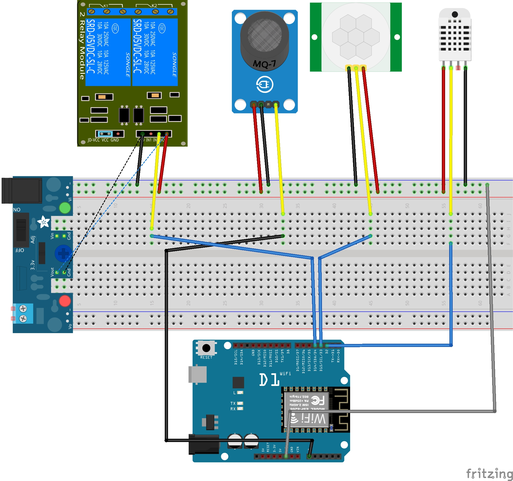

3dprinter_project
----------------------------------
我們使用esp8266提供的函式庫，將所有資料用http server的方式紀行架設，開發板會連上住家的wifi然後供區域網路內的網頁server做請求，請求/on打開繼電器，請求/off關閉繼電器，兩種請求都會回傳完整的json資料，給後端解析，此外我們還加入了自製的GM1602函式庫，讓客製化傳感器可以運行。

電路圖
----------------------------------
